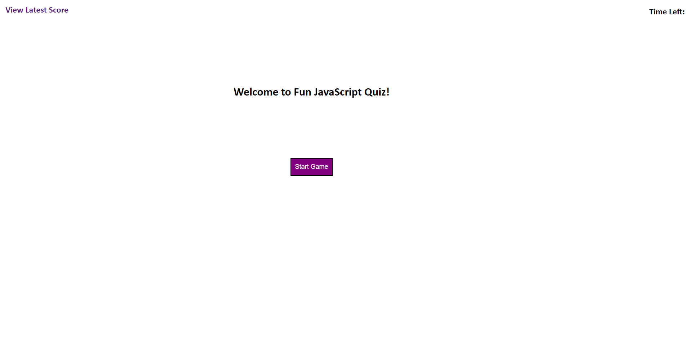
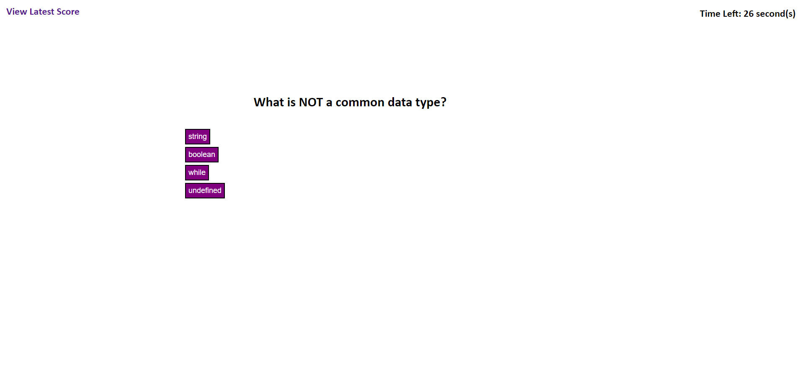
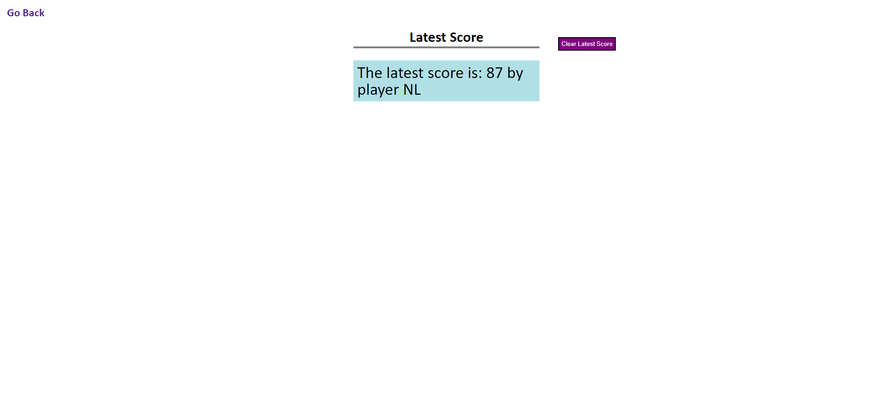

# Fun JavaScript Quiz

This project has the user play a quiz and scores them at the end saving their last score

## User Story

```
AS A student who wants to practice my JS knowledge
I WANT to play a fun game that quizzes me on my knowledge of basic JS
SO THAT I can better improve my skills as a developer
```
## Usage

Click Start Game to start the quiz

Read the questions and click the answer you think is right, if you are right you get 5 score otherwise you lose 5 seconds

Gain 5 score for every correct answer plus two score for every second remaing on the clock!

When you have completed the game enter your initals to save your latest score and click submit to go to the score page, click Clear Latest Score to remove your score

## Images

### Before the quiz



### Game Inprogress



### Score Page



## GitHub Links

### [Repository](https://github.com/PierTwo/fun-js-quiz)

### [Deployed application](https://piertwo.github.io/fun-js-quiz/)

